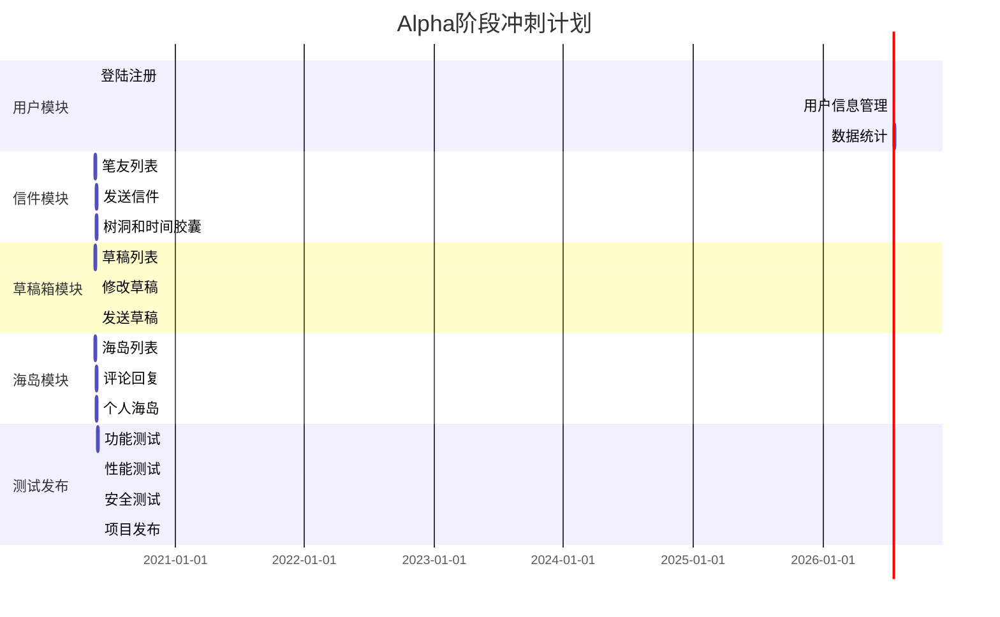

[TOC]

Author：[歪瑞古德小队](https://www.cnblogs.com/misterchaos/p/12766888.html)

Project：[海岛漂流](https://www.cnblogs.com/misterchaos/p/12815587.html)

## 一、需求&原型改进

### 1.1 用户需求调查

为了进一步理解用户的需求和痛点，我们通过发放问卷的方式调查当代年轻人的社交习惯和需求，并收集用户对于社交类应用开发者的建议。以下是问卷的数据报表和分析。

**Q1：你对现在主流的社交应用的感受是？**

这道题目的设计目的是调查用户对新型社交应用的需要程度和对目前主流社交应用的感受

调查结果显示，认为主流的社交应用没有新鲜感的人数占比最多，也有相当一部分人认为目前主流的社交应用的功能不足以满足他们的需求，表示不喜欢的使用社交应用的人数占比很小。

**Q2：你会因为什么原因减少使用或者卸载一款社交应用？**

这道题目从用户卸载一款社交应用的原因的角度调查用户使用社交应用的痛点

调查结果显示，社交应用导致用户流失的主要原因是使用过程中出现烦人的广告，使用过程中看到很多过激和不当的言论，应用中的内容质量差，信息繁杂等。

**Q3：你会因为什么选择使用一款新的社交应用？**

这道题目调查用户选择使用新的社交应用的原因，以便寻找应用的核心竞争力

调查结果显示，产品的新功能最容易吸引用户使用一款新的社交应用，其次是应用中有优质的内容，在上面找到了喜欢的人或者圈子，社区的氛围好等原因。

**Q4：你对写信这种社交方式的看法是？**

这道题目调查用户对于写信这种社交方式的接受程度和兴趣

调查结果显示，不会写信，但是想要的尝试的人数占比最多，其次是喜欢写信，但是没有写信的对象。因此本应用应该致力于帮助用户快速学习写信，以及找到写信的笔友。

其中不喜欢写信的原因如下：

| 选项       | 原因                                         |
| ---------- | -------------------------------------------- |
| 不喜欢写信 | 写信是慢节奏的通信方式，已经不太适合现代通信 |
| 不喜欢写信 | 这种交流方式反馈时间太长了                   |
| 不喜欢写信 | 直接可以微信或者电话就可以聊天               |
| 不喜欢写信 | 我字丑                                       |

**Q5：你对社交类应用开发者有什么建议？**

以下是一些具有代表性的建议：

| 你对社交类应用开发者有什么建议？                             |
| ------------------------------------------------------------ |
| 建议界面做的好看一点，并且求求大家善待设计组，设计组非常不容易。而且希望该软件可以有比较好的交互，不要学习某微博，交互按钮做的非常奇怪，好像倒大霉一样，而且该应用还经常崩，时不时就裂开 |
| 社交类软件应该加设电脑或手机投屏功能，如果已经有了这个功能，应该去优化这个功能，例如提高共享屏幕的分辨率和稳定性，减少卡顿，掉帧，数据包丢失的情况发生 |
| 创新吧有自己的风格有足够新有趣的点可以吸引人                 |
| 界面简洁才是用户最想要的，首页不要挤满东西，想要做什么我们自己会点 |

从调查结果来看，用户比较在意的是简洁美观的界面和新颖独特的功能。

### 1.2 选题需求改进

在向目标用户展示原型之后，针对用户提出的问题，我们做出如下改进：

**问题1**：我觉得邮箱地址属于用户隐私，查看其他人的个人资料时不要显示出来

**改进1**：其他人查看的个人资料的页面隐藏邮箱地址

**问题2**：我觉得不能未经对方同意就添加对方为笔友

**改进2**：去掉添加笔友功能，提供给陌生用户写信功能，第一次给对方写信之后自动添加为笔友

**问题3**：我觉得树洞内容不能修改，不然会出现留言和树洞内容不对应的情况

**改进3**：去掉修改树洞内容的功能

**问题4**：能不能限制用户输入一些敏感词？不然匿名的应用很容易出现各种低俗内容

**改进4**：后台服务器加入敏感词过滤系统，屏蔽信件，树洞，海岛等公开内容的敏感词

### 1.3 功能分析的四个象限

| 需求\功能    | **外围功能**                         | **杀手功能**         |
| ------------ | ------------------------------------ | -------------------- |
| **必要需求** | 用户信息管理，海岛功能               | 信件功能             |
| **辅助需求** | 树洞功能，时间胶囊功能，数据统计功能 | 笔友功能，草稿箱功能 |

### 1.4 完善需求规格说明书

完整的需求规格说明书：[需求规格说明书](https://www.cnblogs.com/misterchaos/p/12815587.html)

我们主要是对功能需求列表的部分做出修改，以解决用户提出的问题，修改后的功能列表如下：

|       功能       | 详细描述                                                     |
| :--------------: | :----------------------------------------------------------- |
|   **登录注册**   | 用户使用账号密码登录 用户注册一个账号 用户选择忘记密码 |
| **用户信息管理** | 用户修改密码 用户修改头像 用户修改笔名 用户修改邮箱 用户修改签名 |
|   **我的邮票**   | 用户可以查看自己拥有的邮票列表                               |
|     **通知**     | 用户收到新信件时进行提醒 用户看完通知之后信件状态改变    |
|   **书写信件**   | 书写新的信件 选择信件的信纸（背景）                       |
|   **发送信件**   | 随机选择笔友 选择一个发送的笔友 选择一张使用的邮票 系统根据两边距离计算发信所需时间 发信消耗一张邮票 |
|    **草稿箱**    | 用户查看草稿 用户编辑草稿 用户更新草稿 用户发送草稿 |
|     **笔友**     | 第一次给对方写信之后自动添加为笔友 用户可以看到笔友列表 用户点击笔友可以看到两人之间来往的信件 用户可以给笔友写信 |
|   **个人海岛**   | 每个用户有一个自己的海岛 用户可以设置自己海岛的背景      |
|   **他人海岛**   | 用户可以看到他人海岛的动态  动态可以看到内容，发送时间，发送者，浏览量 用户可以在动态下面评论和回复 |
|   **进入海岛**   | 漂流：用户可以随机到达一个海岛 用户可以根据海岛名称搜索海岛 到达一个海岛后有一定几率获得邮票和时间胶囊 |
|   **海岛列表**   | 用户可以看到自己标记过的海岛列表 用户可以在自己的海岛发动态 用户可以标记他人的海岛 |
|   **数据统计**   | 发送了多少信件 受到过多少信件 在信件中写过多少文字 路过多少个海岛 |
|   **创建树洞**   | 用户可以创建一个树洞，填写树洞名称，树洞内容 用户最多只能创建5个树洞 其他用户可以查看树洞内容 其他用户可以在树洞下面留言（只能给树洞留言，不能互相回复） |
|   **删除树洞**   | 删除已经创建的树洞                                           |
|   **时间胶囊**   | 用户书写一封信 用户可以指定在将来某个时间打开这个胶囊 用户一开始只有3个胶囊 把一封信放进胶囊会消耗一颗胶囊 |

### 1.5 任务分解WBS调整

根据用户提出的问题，调整任务分解WBS如下：

### 1.6 项目进度计划调整

根据用户提出的问题，对具体的功能需求做出调整，并把树洞，时间胶囊功能调整到第二版，海岛功能调整到第三版。调整后的项目进度计划如下：

| 功能             | 功能详情                                                     | 所属版本  |
| :--------------- | :----------------------------------------------------------- | :-------: |
| **登录注册**     | 用户使用账号密码登录<br用户注册一个账号 用户选择忘记密码  | Alpha 1.0 |
| **用户信息管理** | 修改密码 修改头像 修改笔名 修改邮箱 修改签名     | Alpha 1.0 |
| **我的邮票**     | 用户可以查看自己拥有的邮票列表                               | Alpha 1.0 |
| **通知**         | 用户收到新信件时进行提醒 用户看完通知之后信件状态改变    | Alpha 1.0 |
| **书写信件**     | 书写新的信件 选择信件的信纸（背景）                       | Alpha 1.0 |
| **发送信件**     | 随机选择笔友 选择一个发送的笔友 选择一张使用的邮票 系统根据两边距离计算发信所需时间 发信消耗一张邮票 | Alpha 1.0 |
| **草稿箱**       | 查看草稿 编辑草稿 更新草稿 发送草稿               | Alpha 1.0 |
| **笔友**         | 第一次给对方写信之后自动添加为笔友 用户可以看到笔友列表 用户点击笔友可以看到两人之间来往的信件 用户可以给笔友写信 | Alpha 1.0 |
| **数据统计**     | 发送了多少信件 受到过多少信件 在信件中写过多少文字 路过多少个海岛 | Alpha 2.0 |
| **创建树洞**     | 用户可以创建一个树洞，填写树洞名称，树洞内容 用户最多只能创建5个树洞 其他用户可以查看树洞内容 其他用户可以在树洞下面留言（只能给树洞留言，不能互相回复） | Alpha 2.0 |
| **删除树洞**     | 删除已经创建的树洞                                           | Alpha 2.0 |
| **时间胶囊**     | 用户书写一封信 用户可以指定在将来某个时间打开这个胶囊 用户一开始只有3个胶囊 把一封信放进胶囊会消耗一颗胶囊 | Alpha 2.0 |
| **个人海岛**     | 每个用户有一个自己的海岛 用户可以设置自己海岛的背景      | Alpha 3.0 |
| **他人海岛**     | 用户可以看到他人海岛的动态 动态可以看到内容，发送时间，发送者，浏览量 用户可以在动态下面评论和回复 | Alpha 3.0 |
| **进入海岛**     | 漂流：用户可以随机到达一个海岛 用户可以根据海岛名称搜索海岛 到达一个海岛后有一定几率获得邮票和时间胶囊 | Alpha 3.0 |
| **海岛列表**     | 用户可以看到自己标记过的海岛列表 用户可以在自己的海岛发动态 用户可以标记他人的海岛 | Alpha 3.0 |

## 二、后端架构文档

### 2.1 文档简介

#### 2.1.1  目的

本文档将从构架方面对系统进行综合概述，其中会使用多种不同的构架视图来描述软件系统的各个方面，记录并表述已对系统的构架方面作出的重要决策。

#### 2.1.2  范围

本文档用于**歪瑞古德小队**正在开发中的**海岛漂流项目。海岛漂流项目**是一款以信会友的**匿名游戏化社交**应用。 

#### 2.1.3  定义、首字母缩写词和缩略语

| 术语     | 解释                                                         |
| -------- | ------------------------------------------------------------ |
| 信件     | 本系统中的信件是指以信件的格式书写的计算机文本，通过互联网在本系统中的用户之间传递信息 |
| 树洞     | 本系统中的树洞是指一个匿名的公共空间，用户以匿名的方式在此空间留言 |
| 时间胶囊 | 本系统中的时间胶囊是指用户书写的信件可以设定一个未来的时间开启。 |
| 海岛     | 本系统中的海岛是指每个用户拥有的一个个人空间，用户可以在个人空间中发布自己的动态 |

#### 2.1.4  参考资料

暂无

### 2.2 架构表示方式

本文档通过以下一系列视图来表示海岛漂流项目的软件架构：用例视图，部署视图，数据视图

### 2.3 架构目标和约束

1. 本系统在开发过程中有如下设计约束：开发语言为Java，采用关系型数据库存放数据。
2. 所有用户必须在保证网络连接的情况下可通过互联网访问系统
3. 系统必须保证数据的安全访问，用户需通过用户名和密码来进行身份验证，同时对数据的访问要进行授权验证

### 2.4 用例视图

### 2.5 部署视图

#### 2.5.1 User Client

用户主要通过APP来访问系统，暂时只支持安卓系统

#### 2.5.2 Server

应用服务器运行海岛漂流系统，采用nginx对用户请求进行分流，同时搭建服务器集群进行负载均衡。系统采用SpringBoot框架搭建，同时采用MyBatis-plus框架与数据库进行交互。

#### 2.5.3 DB Server

数据服务器运行mysql5.7数据库

### 2.6 数据视图

**数据库ER图：**

**friend表：**

| 列名           | 注释         | 类型         |
| -------------- | ------------ | ------------ |
| friend_id      | id           | int(255)     |
| friend_user_id | 笔友的用户id | int(255)     |
| user_id        | 用户的id     | int(255)     |
| remark         | 笔友备注     | varchar(255) |

**letter表：**

| 列名         | 注释                                  | 类型         |
| ------------ | ------------------------------------- | ------------ |
| letter_id    | 信件id                                | int(255)     |
| sender_id    | 发送者id                              | int(255)     |
| send_time    | 发送时间                              | datetime     |
| receiver_id  | 接收者id                              | int(255)     |
| receive_time | 接收时间                              | datetime     |
| content      | 信件内容                              | text         |
| paper        | 信纸                                  | varchar(255) |
| is_send      | 是否发送(true=发送，false=保存为草稿) | tinyint(255) |
| stamp_id     | 使用的邮票id                          | int(11)      |
| header       | 信件标题                              | varchar(255) |

**message表：**

| 列名         | 注释       | 类型         |
| ------------ | ---------- | ------------ |
| message_id   | 树洞留言id | int(255)     |
| writer_id    | 留言者id   | int(255)     |
| content      | 内容       | varchar(255) |
| tree_hole_id | 树洞id     | int(255)     |
| time         | 留言时间   | datetime     |

**notice:**

| 列名      | 注释                     | 类型         |
| --------- | ------------------------ | ------------ |
| notice_id | 通知id                   | int(255)     |
| user_id   | 用户id                   | int(255)     |
| is_read   | 是否已读(0=未读，1=已读) | tinyint(255) |
| title     | 通知标题                 | varchar(255) |
| content   | 通知内容                 | varchar(255) |

**post表：**

| 列名    | 注释       | 类型     |
| ------- | ---------- | -------- |
| post_id | 海岛动态id | int(255) |
| user_id | 用户id     | int(255) |
| content | 内容       | text     |
| time    | 发布时间   | datetime |
| view    | 浏览量     | int(255) |

**reply表：**

| 列名        | 注释           | 类型         |
| ----------- | -------------- | ------------ |
| reply_id    | 回复id         | int(255)     |
| writer_id   | 回复者id       | int(255)     |
| be_reply_id | 被回复的回复id | int(255)     |
| content     | 回复内容       | varchar(255) |
| post_id     | 帖子id         | int(255)     |
| time        | 回复时间       | datetime     |

**stamp表：**

| 列名       | 注释     | 类型         |
| ---------- | -------- | ------------ |
| stamp_id   | 邮票id   | int(11)      |
| user_id    | 用户id   | int(255)     |
| stamp_name | 邮票名称 | varchar(255) |

**star表：**

| 列名      | 注释       | 类型     |
| --------- | ---------- | -------- |
| star_id   | 星标id     | int(255) |
| user_id   | 用户id     | int(255) |
| island_id | 海岛用户id | int(255) |

**tree_hole表：**

| 列名         | 注释     | 类型     |
| ------------ | -------- | -------- |
| tree_hole_id | 树洞id   | int(255) |
| creator_id   | 创建者id | int(255) |
| content      | 树洞内容 | text     |
| create_time  | 创建时间 | datetime |

**user表：**

| 列名       | 注释           | 类型         |
| ---------- | -------------- | ------------ |
| user_id    | 用户id         | int(255)     |
| username   | 用户名         | varchar(255) |
| password   | 密码           | varchar(255) |
| mail       | 邮箱           | varchar(255) |
| word       | 用户写过的字数 | int(255)     |
| photo      | 头像           | varchar(255) |
| nickname   | 昵称           | varchar(255) |
| signature  | 签名           | varchar(255) |
| background | 海岛背景       | varchar(255) |
| city       | 所在城市       | varchar(255) |
| capsule    | 胶囊数量       | int(11)      |

### 2.7 大小与性能

本系统采用的软件架构可以很好的支持以下性能需求：

- 系统的平均响应时间应该在500ms以内
- 系统的平均吞吐量应该达到300TPS以上
- 系统应该至少能够承载10万以上的总用户量
- 系统应该支持300以上的并发用户数

### 2.8 质量

本系统采用的软件结构可以很好的支持系统质量方面的需求：

1. 系统应当方便所有用户的使用，对于普通用户的培训时间不应该超过20分钟。

2. 系统必须能够保证每天24小时不间断运行，服务可用率达99.99%。

3. 合理的设计系统结构以保证较高的可维护性，系统的模块应该可以替换。

4. 系统应当正确处理发生的异常或错误，并返回错误信息。

5. 系统应当具备健全的日志系统，以便及时排查错误原因。

## 三、Alpha任务分配计划

### 3.1 Product Backlog和Sprint Backlog

依据项目组能提供的总时间、功能模块的优先级以及模块之间的依赖关系，在Product Backlog中选取待实现的功能项，对已选择的功能项再做进一步分解，分解为1-10小时左右的任务，构成Sprint Backlog。

| Product Backlog | Sprint Backlog                     |
| --------------- | ---------------------------------- |
| 用户模块        | 登陆注册，用户信息管理，数据统计   |
| 信件模块        | 笔友列表，发送信件，树洞和时间胶囊 |
| 草稿箱模块      | 草稿列表，修改草稿，发送草稿       |
| 海岛模块        | 海岛列表，评论回复，个人海岛       |

### 3.2 开发任务分配

在PM的协助下，编码的同学对任务进行认领，分工的结果如下：

| 开发任务           | 前端页面负责人 | 后端接口负责人       | 预计工时 |
| ------------------ | -------------- | -------------------- | -------- |
| 登陆注册功能       | 余圣源         | 黄煜淇               | 4h       |
| 用户信息功能       | 余圣源         | 黄煜淇，陈宇，丘丽珊 | 4h       |
| 数据统计           | 余圣源         | 黄钰朝               | 4h       |
| 笔友列表           | 余圣源         | 陈宇                 | 8h       |
| 发送信件           | 余圣源         | 黄钰朝               | 4h       |
| 树洞和时间胶囊功能 | 余圣源         | 黄煜淇，陈宇         | 8h       |
| 草稿箱列表         | 张文俊         | 黄煜淇               | 4h       |
| 修改草稿           | 张文俊         | 黄钰朝               | 2h       |
| 发送草稿           | 张文俊         | 黄钰朝               | 2h       |
| 个人海岛           | 张文俊         | 黄钰朝，黄煜淇       | 4h       |
| 海岛列表           | 张文俊         | 黄煜淇，陈宇         | 8h       |
| 评论回复           | 张文俊         | 黄煜淇，陈宇         | 4h       |

### 3.3 Alpha阶段冲刺计划甘特图

## 四、测试计划

### 4.1 引言

#### 4.1.1 项目背景

本文档用于**歪瑞古德小队**正在开发中的**海岛漂流项目。海岛漂流项目**是一款以信会友的**匿名游戏化社交**应用

#### 4.1.2 使用人群

项目经理、产品、开发、测试人员

#### 4.1.3 测试方式

软件测试的 W 模型

### 4.2 测试范围

- **功能模块测试**

  信件模块、用户模块、海岛模块、时间胶囊模块、树洞模块五大模块

- **兼容性测试**

  基于 app开发，对多种安卓手机测试

- **压力测试**

  对数据的承载量测试

- **安全测试**

  对系统的安全性能进行测试

### 4.3 测试策略

#### 4.3.1 功能测试

需要对以下功能进行测试：

|       功能       | 详细描述                                                     |
| :--------------: | :----------------------------------------------------------- |
|   **登录注册**   | 用户使用账号密码登录 用户注册一个账号 用户选择忘记密码 |
| **用户信息管理** | 用户修改密码 用户修改头像 用户修改笔名 用户修改邮箱 用户修改签名 |
|   **我的邮票**   | 用户可以查看自己拥有的邮票列表                               |
|     **通知**     | 用户收到新信件时进行提醒 用户看完通知之后信件状态改变    |
|   **书写信件**   | 书写新的信件 选择信件的信纸（背景）                       |
|   **发送信件**   | 随机选择笔友 选择一个发送的笔友 选择一张使用的邮票 系统根据两边距离计算发信所需时间 发信消耗一张邮票 |
|    **草稿箱**    | 用户查看草稿 用户编辑草稿 用户更新草稿 用户发送草稿 |
|     **笔友**     | 第一次给对方写信之后自动添加为笔友 用户可以看到笔友列表 用户点击笔友可以看到两人之间来往的信件 用户可以给笔友写信 |
|   **个人海岛**   | 每个用户有一个自己的海岛 用户可以设置自己海岛的背景      |
|   **他人海岛**   | 用户可以看到他人海岛的动态  动态可以看到内容，发送时间，发送者，浏览量 用户可以在动态下面评论和回复 |
|   **进入海岛**   | 漂流：用户可以随机到达一个海岛 用户可以根据海岛名称搜索海岛 到达一个海岛后有一定几率获得邮票和时间胶囊 |
|   **海岛列表**   | 用户可以看到自己标记过的海岛列表 用户可以在自己的海岛发动态 用户可以标记他人的海岛 |
|   **数据统计**   | 发送了多少信件 受到过多少信件 在信件中写过多少文字 路过多少个海岛 |
|   **创建树洞**   | 用户可以创建一个树洞，填写树洞名称，树洞内容 用户最多只能创建5个树洞 其他用户可以查看树洞内容 其他用户可以在树洞下面留言（只能给树洞留言，不能互相回复） |
|   **删除树洞**   | 删除已经创建的树洞                                           |
|   **时间胶囊**   | 用户书写一封信 用户可以指定在将来某个时间打开这个胶囊 用户一开始只有3个胶囊 把一封信放进胶囊会消耗一颗胶囊 |

试图发现以下几类错误：

- 是否有不正确或遗漏的功能。
- 在接口上，能否正确地接受输入数据，能否产生正确地输出信息。
- 访问外部信息是否有错。
- 界面是否有错，是否不美观。
- 初始化或终止错误。

#### 4.3.2 系统兼容性测试

对于移动端的用户，对不同安卓手机进行测试

####    4.3.3 性能压力测试

采用apache的开源测试工具jmeter，通过http协议发送访问请求，收集服务器响应速度，监控服务器运行状态和资源耗用情况

####    4.3.4 安全测试

用acunentix测试，测试人员模拟非法入侵，采用各种方法冲破防线。记录各项攻击数据，破防时间，攻击地点，攻击方式及代价。

### 4.4 测试资源

#### 4.4.1 测试人员

后端测试人员：陈宇、黄煜淇、黄钰朝、丘丽珊

前端测试人员：余圣源、张文俊

####    4.4.2 测试环境

手机：Android 手机

网络环境：WIFI、手机移动网络

#### 4.4.3 测试工具

postman,jmeter

####    4.4.4 测试服务器

阿里云服务器

### 4.5 进度安排

| 任务                                       | 时间       | 执行人员                     | 预期工作量  |
| ------------------------------------------ | ---------- | ---------------------------- | :---------- |
| 编写测试计划                               | 2020.05.19 | 陈宇                         | 半天        |
| 测试计划的修改                             | 项目全程   | 全体人员                     | 半天        |
| 第 一 轮 的 功 能 测 试 （包含兼容性测试） | 2020.05.27 | 陈宇、黄煜淇、黄钰朝、丘丽珊 | 半天        |
| 性能测试、回归测试                         | 2020.05.29 | 陈宇、黄煜淇、黄钰朝、丘丽珊 | 2 小时      |
| 发布前内测                                 | 2020.06.01 | 全体成员                     | 1 小时      |
| 测试报告总结                               | 发布后     | 陈宇                         | 半天        |
| 合计                                       |            |                              | 4 天 3 小时 |

###  4.6 输出文档

   《项目测试计划书》

   《项目测试报告书》

### 4.7 发布标准

- 完成所有的测试类型
- 没有影响用户正常使用的 bug
- 通过压力测试，并且设计符合用户要求
- 没有 bug 或 bug 经过风险评估
- 通过交叉检查，非该代码开发人员测试通过
- 产品使用说明书或用户手册等已经完备

### 4.8 风险说明

- 上述工作量的预估中，对需求的变更进行了一定的风险覆盖，但如果需求的变更超出目前的预计，则可能导致编写测试用例和执行测试相关工作量的增加、测试进度延迟。
- 开发提交的测试版本比该计划的风险，发生此种情况时，执行测试的时间应该合理顺延。
- 提交测试版本质量较低的风险，可能导致比该计划更多轮次的回归测试。

## 五、前端设计文档

### 5.1 前端基础描述

| Vue  | 用于构成整个html，css，js的框架    |      |
| ---- | ---------------------------------- | ---- |
| Weex | 用于将前端代码打包行成安卓java代码 |      |

### 5.2 前端基础功能划分

| 功能概述     | 功能描述                                                     |
| ------------ | ------------------------------------------------------------ |
| 登陆注册展示 | 提供用户注册和进入系统的入口                                 |
| 笔友页面     | 1.展示笔友列表。2.时间胶囊，给未来的自己写一封信。3.树洞。   |
| 草稿页面     | 1.给用户编写草稿，                                           |
| 海岛展示页面 | 1.海岛列表 2.评论回复 3.个人海岛                             |
| 我的信息页面 | 1.我的信息需要提供给用户一个查看自己账户资料，编辑资料的功能。2.查看自己拥有的邮票。3.查看自己的消息。4.退出登陆 |

### 5.3 设计原型图

#### 5.3.1 登陆注册页面

#### 5.3.2 写作页面

笔友列表

树洞

时间胶囊

#### 5.3.3 草稿箱页面

#### 5.3.4 我的页面

我的-主页

我的-信息修改

#### 5.3.5 海岛

